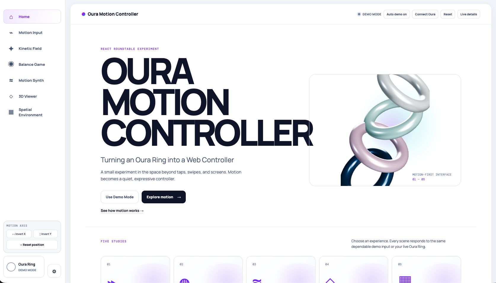
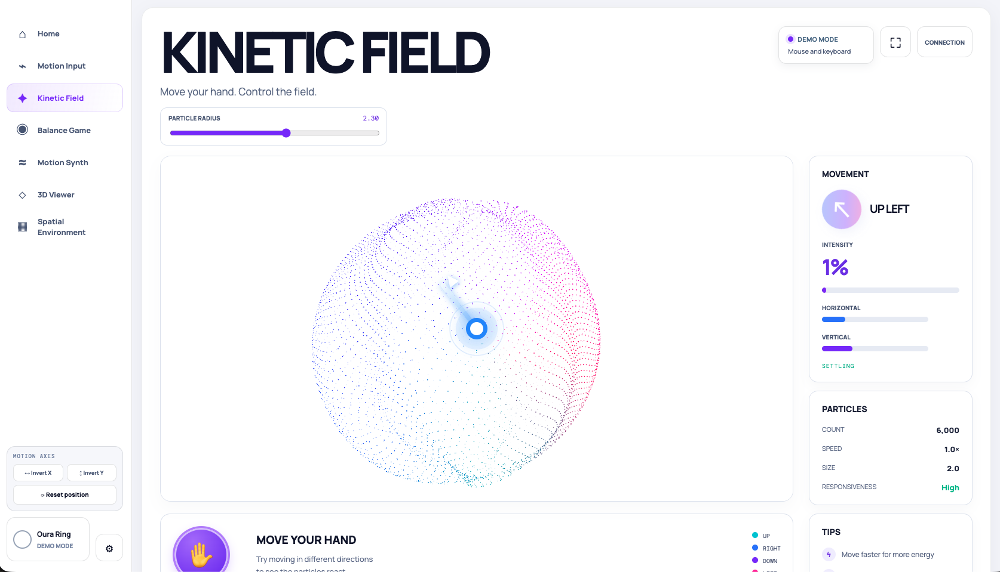
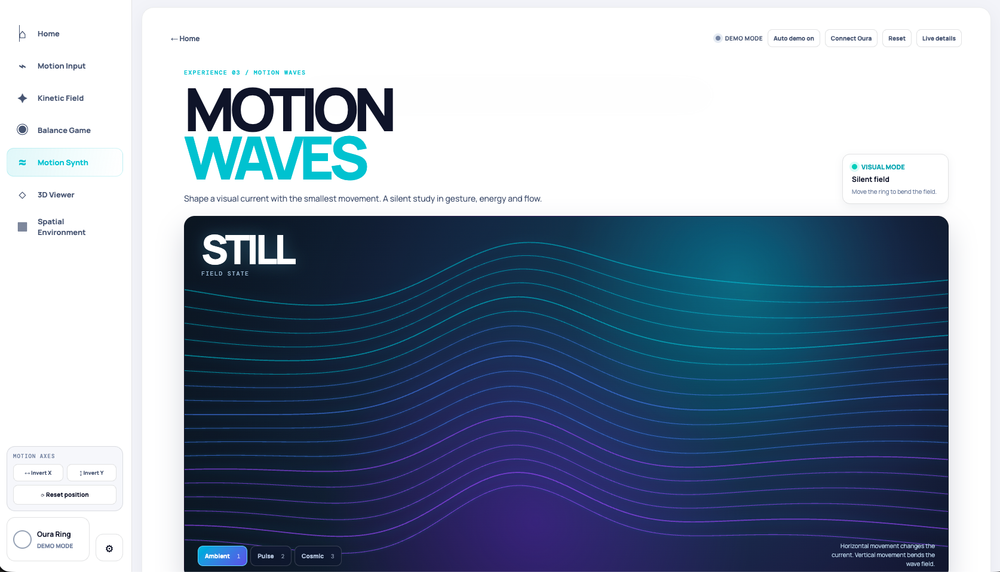

# Oura Motion Controller

A motion-first web experiment: use an Oura Ring as a wireless controller for visual, spatial and 3D experiences.

It works in two ways:

- **Demo Mode** — mouse, keyboard and auto-demo. No ring required.
- **Live Oura Mode** — your Oura Ring streams motion to the app through a local Bluetooth bridge on your Mac.

## Desktop gallery

| Home | Kinetic Field |
| --- | --- |
|  |  |

| Motion Waves |
| --- |
|  |

## What you can explore

- **Motion Input** — visualizes tilt, direction and intensity.
- **Kinetic Field** — moves a responsive particle sphere.
- **Balance Game** — tilts a 3D maze to guide a ball.
- **Motion Synth** — turns movement into animated waveforms.
- **3D Furniture Viewer** — rotates and tilts a lounge chair.
- **Spatial Environment** — controls a temperature wheel.

## Start in Demo Mode

This is the fastest way to try the project.

```bash
pnpm install
pnpm dev
```

Open [http://localhost:5173](http://localhost:5173). Move the pointer, use the arrow keys or WASD, and select any experience from the sidebar.

## How Live Oura Mode works

```text
Oura Ring
   ↓ Bluetooth Low Energy
open_oura (local bridge on your Mac)
   ↓ local SSE motion stream
Vite local proxy
   ↓
React MotionProvider
   ↓
Every interactive experience
```

Bluetooth and the Oura authentication key stay on your computer. The browser receives only local motion samples; it never pairs with the ring or stores its key.

## Connect an Oura Ring on macOS

### 1. Prerequisites

- Install [Node.js](https://nodejs.org/) and pnpm.
- Install Rust/Cargo for the local `open_oura` bridge.
- Allow Bluetooth access for your terminal in **System Settings → Privacy & Security → Bluetooth**.
- Keep the Oura app closed while testing. If it is holding the connection, temporarily turn Bluetooth off on your phone.

### 2. Create local configuration

```bash
cp .env.oura.example .env.oura
```

Edit `.env.oura`:

- Set `OURA_KEY_FILE` to an absolute path **outside this repository**.
- Leave `OURA_RING_ADDRESS=` empty on macOS. The Bluetooth identifier may rotate, so discovery by name is more reliable.
- Set `OURA_RING_NAME=Oura Ring 4` (or the advertised name of your ring).
- Set `OURA_STREAM_MINUTES` to the maximum presentation time you need.

Never commit `.env.oura`, the auth key, device captures or serial information.

### 3. Build and connect

```bash
pnpm oura:setup
pnpm oura:scan
```

The scan should list the ring nearby. If it does, pair it only when you are using a dedicated, manually factory-reset ring:

```bash
OURA_CONFIRM_PAIR=1 pnpm oura:pair
```

Then check that the ring can provide authenticated information and motion:

```bash
pnpm oura:verify
```

Finally start the web app and local bridge together:

```bash
pnpm dev:live
```

Wait until the terminal says `Ready — open http://127.0.0.1:8088`, open [http://localhost:5173](http://localhost:5173), and select **Connect Oura**. Hold the ring still for the neutral-position calibration.

The sidebar shows the current connection state, an initial battery reading, axis inversion controls, and **Reset position** for recalibration.

## Useful commands

| Command | What it does |
| --- | --- |
| `pnpm dev` | Starts the site in Demo Mode. |
| `pnpm dev:live` | Starts Vite and the local Oura bridge. |
| `pnpm oura:scan` | Finds nearby Oura Rings. |
| `pnpm oura:verify` | Checks connection, authentication and accelerometer data. |
| `pnpm oura:stop` | Stops the Vite server and Oura bridge. |
| `pnpm build` | Runs TypeScript checks and creates a production build. |

## Troubleshooting

**`no matching Oura ring found`**

1. Run `pnpm oura:stop`.
2. Close the Oura app / turn off phone Bluetooth temporarily.
3. Keep the ring close to the Mac and run `pnpm oura:scan`.
4. Do not pair again if `pnpm oura:verify` had already worked before.

**`ECONNREFUSED 127.0.0.1:8088` immediately after `pnpm dev:live`**

Vite usually starts before the bridge. Wait for the `Ready` message; then refresh the browser and connect the ring. If `Ready` never appears, stop everything with `pnpm oura:stop` and start again.

**The movement feels reversed**

Use **Invert X** or **Invert Y** in the sidebar. Use **Reset position** while holding your hand in the comfortable neutral position.

## Notes and limitations

Live Oura Mode uses gravity-based tilt and motion intensity. It does not provide exact hand position, reliable yaw, finger tracking or Oura health scores. Every experience remains usable in Demo Mode if Bluetooth is unavailable.

## Acknowledgements

Live Oura Mode is possible thanks to [Th0rgal/open_oura](https://github.com/Th0rgal/open_oura), the local open-source client that makes it possible to communicate with the ring over Bluetooth. Follow its license and safety notes. Pairing requires an app authentication key; this project does not extract keys or automate factory resets.
